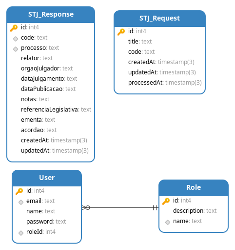

# Funcionamento

## Padrão
- É incluída na fila uma requisição de busca por meio de uma requisição POST para o endpoint **"/jstj"**.
- O serviço de busca de jurisprudência do STJ é acionado a cada 10 minutos por um CRON.
- O resultado da busca é salvo no banco de dados.

## Ao vivo
- O serviço de busca de jurisprudência do STJ é acionado através de uma requisição diretamente ao endpoint **"/jstj/live/:code"**.
- O resultado da busca é retornado sem ser salvo no banco de dados.

## Diagrama do banco de dados

## Swagger

Pode ser acessado ao executar a aplicação em desenvolvimento no endereço http://localhost:3000/doc.

## Nomenclaturas
- **JSTJ**: Jurisprudência do Superior Tribunal de Justiça
- **STJ**: Superior Tribunal de Justiça